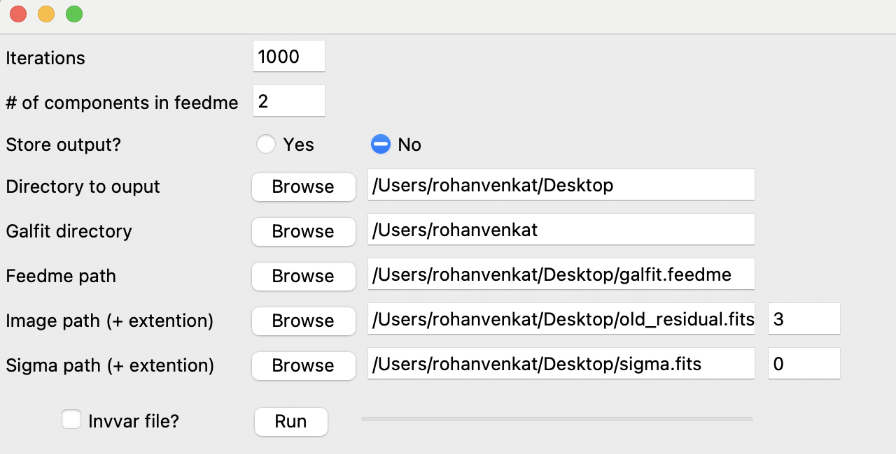

The executable to use is called "AutoGalfit". This is a wrapper software around Galfit which performs the following additional features

1. Can automatically run galfit an arbitrary number of times (the general recomendation for a monte-carlo procedure like this is 1000-10,000 trials)
2. Randomly adjusts each pixel value in the image based on the inputted weight map
2. Randomly adjusts the initial guesses (Galfit has a tendancy to care about the guess provided in the feedme file)

Additionally, we provide our code which is in the file called "AutoGalfit_SC". Feel free to let us know if you have any suggestions, my email is rvenkatphys@gmail.com, thank you!

Here is what the UI should look like after a few seconds from double clicking on the executable file:

1. **Iterations** specifies the number of times to run Galfit
2. **# of components in feadme** is the number of objects which will be fit (e.g if we want to fit a sersic and a psf then we'll say 2)
3. **Store Output?** is to whether we want to store outputs from every trial of galfit (generally we don't want to unless we want to see if something is wrong, this can be a lot of storage)
4. **Directory to Output** asks where we want to store all the AutoGalfit output files
5. **Galfit directory** asks for the location of your Galfit executable file in your system (note, not the location of the AutoGalfit executable)
6. **Feedme Path** asks for the location in your system of the galfit feedme file you want to use  
7. **Image Path** asks for the location of the input image to use for fitting and **ext** is the extension number that you want Galfit to use of the image (note that this is for FITS files specifically)
8. **Sigma Path** asks the location of the sigma image to use and **ext** is the extension which we want to use for that FITS file
9. **Invvar file?** asks if instead of a sigma image, you are using an inverse variance image (sometimes this is the default weight map which is provided by different sources, so this is just for convenience) 

Special thanks to Matthew Riddle and Adam Tang for designing the user interface!